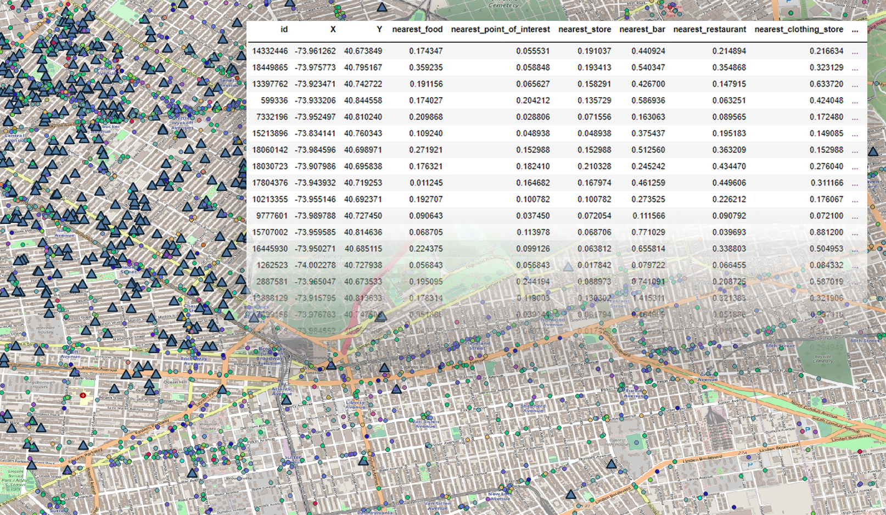

# closestpoint
A tool for finding the shortest distance of a point data set from one category to many other categories.

---

For example, this is an open Airbnb database (check http://insideairbnb.com/get-the-data.html) from New York City. We want to determine the closest distance from each listing to all business categories reported in the city.

# Finding the closest distance from a point to a point in each category of another dataframe

It is possible to determine the closest distance from a point to a given category. Let's do it.

---

### Preparing the environment
#### Installing the requirements.

In this repository we use classic Python libraries for data processing. However, it is important to verify that all dependencies are present.

> `!pip install -r requirements.txt`

- [x] pandas 1.2.x
- [x] numpy 1.16+
- [x] scipy 1.6.x

---

### Importing the core of the application.

`import closestpoint as cp`

> `xy_data = cp.upload_xy_data('../xy_data.csv')` 
> `target_data = cp.upload_target_data('../target_data.csv')`

The `cp.upload_xy_data(filepath)` function receives as a parameter the path of the .csv file where the static data is stored. 
It is important that the longitude / East column is renamed as __X__, in capital letters, as well as the latitude / North as __Y__. 
In the same way, there must be an __'id'__ column that identifies each point.  

id  | X  | Y
------------- | -------------- | -------------
0123456789  | -73.930220  | 40.685737

Although there are other columns, the algorithm __will only take these three__, so you may want to set an id to be able to concatenate this information later.

The `cp.upload_target_data(filepath)` function receives as a parameter the path of the .csv file where the target data is stored. 

id  | X  | Y  | category
------------- | -------------- | ------------- | -------------
0123456789  | -73.247859  | 40.673471  | gym

The parameters of X, Y and id must be followed in the same way in this file. Also, for this specific file the classification column must be named __'category'__, in lowercase. This function will only take these four columns for processing.

---

### Calculating the distances

This program uses Euclidean distances in its algorithm (the closest distance between two points is a straight line between them). In this version, it is recommended that the data be entered in __decimal degrees__, following the WGS84 geographic coordinate system (EPSG: 4326).  
In its first version, we recommend being careful with the amount of data to process, both in static data and target data, since the algorithm calculates ALL distances and then selects the smallest. Therefore, computational consumption must be taken into account.

> `data = cp.find_closest_points(xy_data, target_data)`

---

### Saving the data

It is possible to print the variable where the generated dataframe is saved. In addition, we present a function that allows saving this dataframe as a csv file, using the function `cp.save_csv(df, filepath)`.

> `cp.save_csv(data, '../csv/data.csv')`

---

